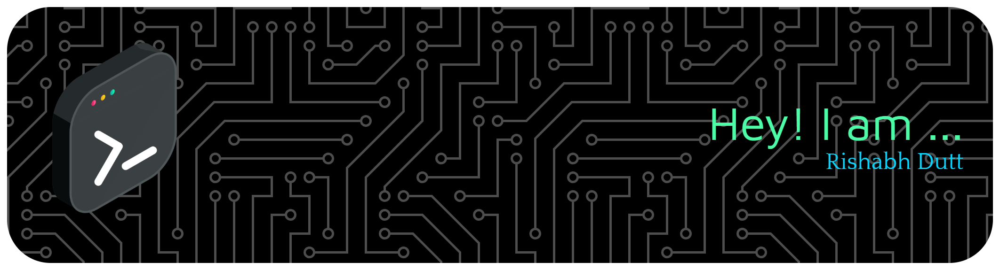

  

<h1 align="center">Hey! 👋 I am Rishabh Dutt</h1>

  <b>Student | Full-Stack Developer | AI-ML Enthusiast |Football Fan</b>

---

### 🛠️ Tech Stack

| Category | Tools & Technologies |
| :--- | :--- |
| **Languages** |    |
| **Frontend** |    |
| **Backend** |    |
| **Database/Cloud**|     |
| **Dev Tools** |   |

---

### 📊 GitHub Statistics

  

---

### 🌟 Featured Projects

- 💰 [**Smart Finance Tracker**](https://github.com/Rishabh200729/Finance-Tracker) – Full-stack app with Next.js, TypeScript & PostgreSQL.
- 🛡️ [**Market Sentry**](https://github.com/Rishabh200729/FinScribe) – AI-driven stock market manipulation detector.
- 🩺 [**Heart Disease Prediction**](https://github.com/Rishabh200729/mlproject) – ML-powered health analytics.
- 🧑‍💬 [**Chat Cord**](https://github.com/Rishabh200729/ChatCord) – Real-time chat application.

---

### 📫 Connect With Me

  <i>“Keep coding, keep growing!”</i>

